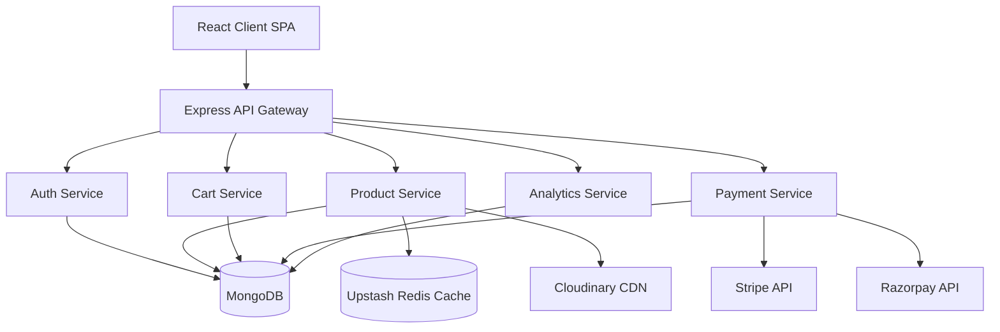
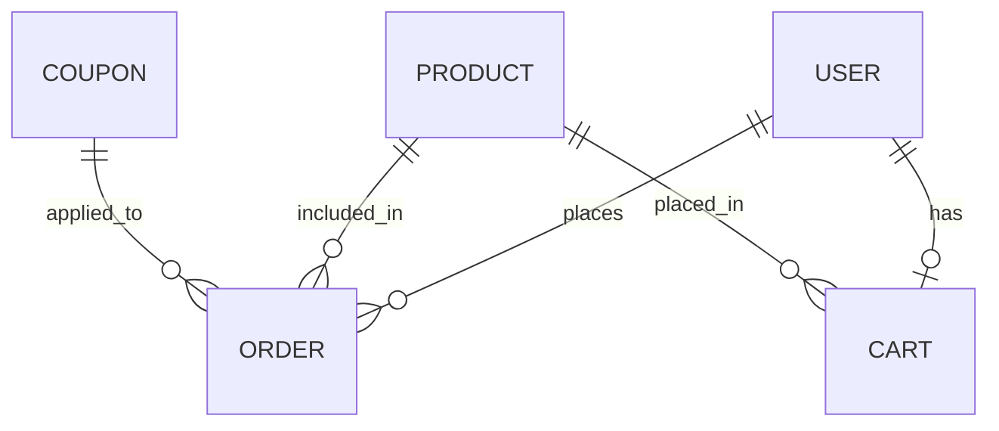

<h1 align="center">MossX</h1>

<p align="center">
  <strong>A high-performance, scalable E-Commerce platform built for modern retail experiences.</strong>
</p>

<p align="center">
  
  
  
  
  
  
</p>

---

## Overview

**MossX** is a production-ready, full-stack E-Commerce application designed to provide a seamless shopping experience for users while offering robust management capabilities for administrators.

Built with scalability and modern developer experience in mind, MossX leverages an Express-driven microservices-like architecture on the backend, complemented by a lightning-fast React frontend. Whether you need guest cart merging, secure Razorpay and Stripe payments, or real-time analytics, MossX handles it with elegance and speed. It aims to solve the complexity of modern e-commerce boilerplate by providing a robust, extensible foundation for startups and retail businesses.

---

## Key Features

### User Features

- **Seamless Shopping Flow**: Browse products by category, search with price ranges, and view tailored recommendations.
- **Advanced Cart System**: Fully featured cart supporting both authenticated users and anonymous guest sessions with intelligent cart merging upon login.
- **Secure Authentication**: Robust JWT-based authentication with seamless token refreshing.
- **Profile & Order Management**: Track past orders, apply promotional coupons, and manage account details.

### Admin Features

- **Comprehensive Dashboard**: Real-time sales analytics and key performance indicators.
- **Inventory Management**: Create, update, and manage products, bundles, and custom collections.
- **Promotions Engine**: Issue and manage discount coupons and featured products.

### E-commerce Features

- **Dynamic Bundles & Collections**: Curate customized product offerings for specific campaigns.
- **Flexible Checkout**: Multi-gateway payment integration featuring Stripe and Razorpay.
- **Coupons & Discounts**: Validation engine for promotional codes.

### Security Features

- **Stateless JWT Auth**: Utilizing short-lived access tokens and secure, HttpOnly refresh tokens.
- **Robust Validation**: Input sanitization and error handling.
- **Payment Security**: Cryptographic webhook signature verification for all payment gateways.

### Performance Features

- **Redis Caching**: Ultra-fast data retrieval for product catalogs and high-traffic queries using Upstash Redis.
- **Asset Optimization**: Cloudinary integration for scalable, optimized image delivery.
- **Efficient Bundling**: Vite-powered lazy loading and code splitting for lightning-fast frontend load times.

### Developer Experience Features

- **Monorepo Architecture**: Managed seamlessly with `pnpm` workspaces for unified dependency resolution.
- **Code Quality Guardrails**: Pre-configured ESLint, Prettier, and Husky Git hooks ensure pristine code quality.
- **Containerized Dev & Prod**: Full Docker support out of the box.

## Architecture



---

## Tech Stack

| Layer                | Technology                 | Purpose                                       |
| -------------------- | -------------------------- | --------------------------------------------- |
| **Frontend**         | React 18, Vite             | High-performance, reactive UI                 |
| **Styling**          | TailwindCSS, Framer Motion | Utility-first styling & fluid animations      |
| **State Management** | Zustand                    | Lightweight, scalable client-side state       |
| **Backend**          | Node.js, Express           | Non-blocking, event-driven API server         |
| **Database**         | MongoDB, Mongoose          | Flexible, document-oriented data storage      |
| **Caching**          | Redis (Upstash)            | In-memory caching for reduced database load   |
| **Authentication**   | JSON Web Tokens (JWT)      | Stateless, secure user session management     |
| **Payments**         | Stripe & Razorpay          | Secure, reliable payment processing gateways  |
| **Storage**          | Cloudinary                 | Cloud-based image management and optimization |
| **Deployment**       | Docker                     | Consistent, reproducible environments         |

---

## System Design Decisions

- **MongoDB as the Primary Data Store**: E-commerce catalogs often require flexible schemas for diverse product attributes (e.g., bundles vs. standalone products). MongoDB's document model handles this polymorphism natively without complex SQL joins.
- **Redis Caching Layer**: To handle traffic spikes during sales events, Redis is employed to cache heavily requested endpoints (like featured products and category lists). This dramatically reduces MongoDB read pressure and latency.
- **Dual-Token Authentication**: Instead of relying purely on session cookies, we use a short-lived JWT Access Token paired with a long-lived, HttpOnly Refresh Token. This mitigates CSRF and XSS risks while providing a smooth UX.
- **Guest Cart Merging Strategy**: To lower the friction of shopping, users can build their cart anonymously. The state is temporarily held, and upon authentication, the system intelligently merges the guest cart with their persistent cloud cart.
- **Multi-Gateway Payment Architecture**: Relying on a single payment provider can be a single point of failure. MossX abstracts payment logic to seamlessly toggle or support both Stripe and Razorpay based on regional requirements.

---

## Folder Structure

```bash
mossx/
├── backend/                  # Express server & API routes
│   ├── controllers/          # Business logic handlers
│   ├── lib/                  # Database connections & utilities
│   ├── middleware/           # Auth and validation pipelines
│   ├── models/               # Mongoose schemas
│   ├── routes/               # API endpoint definitions
│   └── server.js             # Application entry point
├── frontend/                 # React SPA
│   ├── public/               # Static assets
│   ├── src/                  # React components, stores, & views
│   ├── package.json
│   └── vite.config.js
├── Dockerfile                # Production container blueprint
├── package.json              # Monorepo configuration
└── pnpm-workspace.yaml       # Workspace definition
```

---

## Local Development Setup

### 1. Clone the repository

```bash
git clone https://github.com/your-username/mossx.git
cd mossx
```

### 2. Install dependencies

Leverage `pnpm` workspaces to install everything from the root:

```bash
npm install -g pnpm
pnpm install
```

### 3. Environment Configuration

Create a `.env` file in the root directory based on `.env.example` (or copy the provided config):

```bash
cp .env.example .env
```

**Required Environment Variables:**

- `MONGO_URI`: Your MongoDB connection string.
- `UPSTASH_REDIS_URL`: Connection string for Redis instance.
- `ACCESS_TOKEN_SECRET` / `REFRESH_TOKEN_SECRET`: Cryptographic keys for JWT signing.
- `CLOUDINARY_CLOUD_NAME` / `CLOUDINARY_API_KEY` / `CLOUDINARY_API_SECRET`: For image uploads.
- `STRIPE_SECRET_KEY` / `RAZORPAY_KEY_ID` / `RAZORPAY_KEY_SECRET`: Payment gateway credentials.
- `CLIENT_URL`: URL of the frontend (e.g., `http://localhost:5173`).

### 4. Run the Dev Server

```bash
pnpm dev
```

This command concurrently spins up the Vite development server and the Node backend using `nodemon`.

---

## API Documentation

Below is a snapshot of critical API endpoints.

| Method | Route                                 | Purpose                             | Auth Required |
| ------ | ------------------------------------- | ----------------------------------- | ------------- |
| `POST` | `/api/auth/signup`                    | Register a new user account         | No            |
| `POST` | `/api/auth/login`                     | Authenticate user & issue tokens    | No            |
| `GET`  | `/api/products`                       | Retrieve all products (Admin)       | Admin         |
| `GET`  | `/api/products/category/:category`    | Fetch products by specific category | No            |
| `POST` | `/api/cart`                           | Add product to user/guest cart      | Optional      |
| `POST` | `/api/cart/merge`                     | Merge guest cart into user cart     | Yes           |
| `POST` | `/api/payments/create-razorpay-order` | Initialize payment intent           | Yes           |
| `GET`  | `/api/analytics`                      | Fetch sales & revenue analytics     | Admin         |

---

## Database Design

MossX revolves around a highly relational NoSQL design utilizing Mongoose references.

**Major Collections:**

- **Users**: Core identity management, stores hashed passwords, role (`admin`/`customer`), and cart references.
- **Products**: Catalog data including dynamic pricing, categorization, stock tracking, and image URLs.
- **Orders**: Immutable transaction records linking `User`, `Products`, total value, and the payment gateway's Session ID.
- **Coupons**: Promotional codes with expiration logic and relational links to users who have utilized them.
- **GuestCarts**: Temporary storage for anonymous shoppers.



---

## Security

MossX takes a zero-trust approach to application security:

- **JWT Architecture**: Utilizing split access (memory/short-lived) and refresh (HttpOnly cookie) tokens to eliminate local storage vulnerabilities.
- **Password Cryptography**: All passwords are automatically hashed via `bcryptjs` before reaching the database.
- **Input Validation**: Strict schema enforcement at the model level preventing NoSQL injection.
- **Webhook Verification**: Payment webhooks strictly verify cryptographic signatures from Stripe/Razorpay to prevent spoofed successful payments.
- **Rate Limiting**: (Planned) API endpoint protection against brute force and DDoS attacks.
- **Environment Isolation**: Sensitive keys are exclusively managed via `dotenv` and never exposed to the client bundle.

---

## Performance Optimizations

- **Redis Caching**: Frequent, read-heavy operations like fetching featured products or category layouts are cached in Redis, resulting in sub-50ms API response times.
- **Database Indexing**: Critical fields in MongoDB (like `email`, `category`, and `stripeSessionId`) are heavily indexed to reduce query execution time.
- **Lazy Loading**: The React frontend heavily utilizes code-splitting and `React.lazy()` to ensure the initial JS payload is minimal.
- **Image Optimization**: Cloudinary handles dynamic resizing and next-gen format conversion (WebP/AVIF), radically improving LCP (Largest Contentful Paint).

---

## Deployment

MossX is engineered to be cloud-native and easily containerized.

### Docker Deployment

A production-grade `Dockerfile` is included at the root of the project. It uses a workspace-compatible approach to build the React application and serve it via the Express backend.

```bash
# Build the image
docker build -t mossx-app .

# Run the container
docker run -d -p 5000:5000 --env-file .env mossx-app
```

**Production Architecture:**
In a production environment, the backend serves the statically generated Vite assets (`frontend/dist`) directly when `NODE_ENV=production` is set, eliminating the need for a separate Nginx container for the frontend if a monolithic deployment is preferred. This drastically simplifies the CI/CD pipeline and local environment replication.

---

## Challenges & Learnings

Building MossX presented several unique engineering challenges:

- **Guest Cart Merging**: Designing an intuitive cart system for unauthenticated users that seamlessly syncs with the database post-login was tricky. We implemented a temporary local state synced with a robust `/api/cart/merge` backend endpoint, resolving edge cases where a user might log into an account that already had pre-existing cart items.
- **Cache Invalidation Strategy**: Utilizing Redis dramatically improved read speeds, but maintaining cache consistency when an admin updated a product price required careful event-driven invalidation logic in our controllers.
- **Monorepo Complexity**: Managing dependencies between the frontend and backend natively without bloated tooling. `pnpm` workspaces proved to be an elegant solution, enforcing strict boundary rules while keeping installation times significantly lower.

---

## Roadmap

- [x] JWT Authentication & Security
- [x] Stripe & Razorpay Integrations
- [x] Admin Analytics Dashboard
- [x] Redis Caching Implementation
- [ ] Analytics Platform Integration
- [ ] Recommendation Engine powered by user history
- [ ] Comprehensive E2E Testing with Cypress
- [ ] React Native Mobile App Companion
- [ ] Automated CI/CD Pipelines via GitHub Actions

---

## Contributing

We welcome contributions from the community! To get started:

1. Fork the repository
2. Create a feature branch (`git checkout -b feature/amazing-feature`)
3. Commit your changes utilizing conventional commits
4. Push to the branch (`git push origin feature/amazing-feature`)
5. Open a Pull Request for review

Please ensure you run `pnpm run lint` and verify the build before submitting your PR.

---

## License

This project is licensed under the ISC License. See the [LICENSE](./LICENSE) file for more details.
