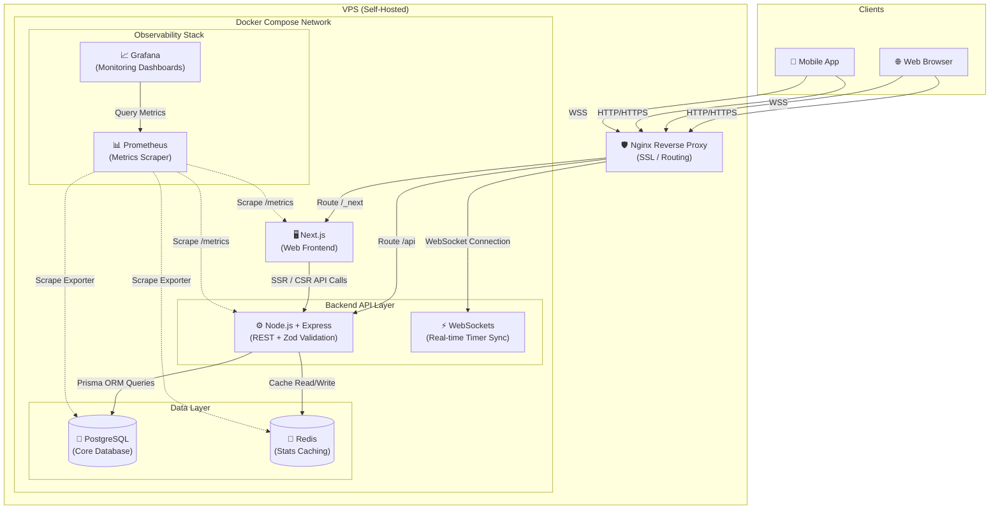

# OpenPumTa: The 21-Day Deep Work System

**Stop burning out on sheer willpower.** OpenPumTa is the only productivity system that tracks your focus, forces 21-day consistency, and uses AI to prevent dopamine burnout—all without locking your data in a walled garden.

## The Problem
You rely on 5 different apps to study—Yeolpumta for timers, Notion for notes, and scattered habit trackers. None talk to each other. When you drop a habit, you lose momentum. The result? Distraction, burnout, and broken streaks. 

## The Outcome
A single, desktop-first workspace that locks you into deep work and builds unbreakable 21-day streaks. 

## How It Works (The Mechanism)
1. **The 6-Habit Limit:** You are only allowed to track up to 6 habits at a time. This prevents overwhelm and forces you to focus on what matters.
2. **"Bad Day Plans":** Every habit has a minimum baseline (e.g., "Do 1 pushup"). On low-energy days, you do the baseline to keep the streak alive. No zeros.
3. **AI Burnout Coach:** The app uses Groq LLMs to analyze your daily reviews and focus logs, identifying burnout risks before you crash.
4. **Instant Timer Sync:** Next.js and WebSockets guarantee your timer feels instantaneous across devices without crashing the database.

## Detailed Features

### Dashboard & Overview
The central hub for your entire day.

- **Quick Actions:** Immediately start a timer for any subject.
- **Habit Section:** Quickly check off your daily habits.
- **Daily Review:** Use this section as a journal/diary, with the ability to review previous journals.
- **Analytics:** View weekly and 21-day analysis charts of your study time and habits.
- **Subject Setup:** Click and quickly configure tracking subjects with a name, goal time per day, color, and difficulty. Link habits directly to subjects so they auto-complete after a certain amount of time passes!

### Habits (21-Day Protocol)
Designed around strict, achievable consistency.

- **The "Perfect Day":** Complete just 4 habits to achieve a "Perfect Day" score. We celebrate your momentum: completing 2 habits triggers small confetti, and hitting 4 triggers a massive celebration!
- **21-Day Heatmap:** Your progress is shown in a 21-day heatmap by default.
- **Subject Linking:** Habits can be linked to subjects for automatic completion during focus sessions.

### Workspace
A Notion-like canvas for your personal productivity systems.

- **Rich Text Blocks:** Use todos, headings, paragraphs, and dividers.
- **Build Your Systems:** Create custom pages like a "Daily Planner" with a section for today's todos and another for the week's priorities.
- **Notion Compatibility:** Copy and paste your existing Notion templates directly into openPumta—they work seamlessly! 

### Clock & Focus
- **Visual Progress:** See the current subject time, total time of the day, and a visual progress ring.
- **Evolving Avatar:** Watch your avatar evolve as your focus time increases throughout the session!

### Stats
We believe in "Show, Don't Tell" when it comes to stats. Dive into detailed visual breakdowns of your performance.

### Settings
Easily configure your profile, subjects, and preferences.

---

## Architecture & System Design

openPumta utilizes a modern, decoupled architecture designed for scalability, real-time syncing, and deep observability.

### The Value Stack
* **Frontend:** Next.js 16, React 19, TypeScript, Tailwind CSS, Zustand, TanStack Query, Recharts.
* **Backend:** Express, Node.js, WebSockets, TypeScript, Zod, Passport, Google OAuth.
* **Data Layer:** PostgreSQL (via Prisma ORM), Redis (Stats Caching).
* **Infrastructure:** Docker Compose, Nginx, Prometheus, Grafana.
* **AI:** Groq API for fast LLM-powered reports.

## The Proof
* Successfully served **1,500+ lifetime visitors**.
* Reduced database load by **over 80%** using Redis caching.
* Maintained **zero downtime** with sub-50ms sync latency. 
