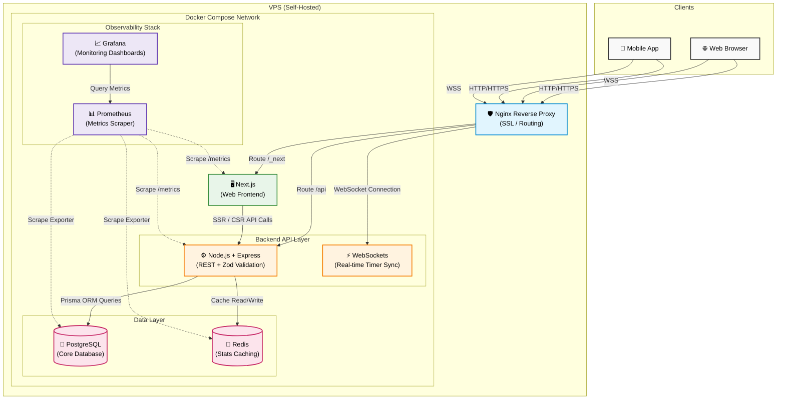

<div align="center">
  <!-- Place your logo or banner image here -->
  

  <!-- <h1>openPumta</h1> -->
  <p>OpenPumta helps ambitious students stay consistent for 21 days at a time through accountability, reflection, and measurable progress.An open-source, desktop-first productivity system integrating Pomodoro focus tracking, habit building, and AI-assisted reflection.</p>
  <p><i>Inspired by Yeolpumta, Notion, and Atomic Habits.</i></p>

  <p>
    <a href="https://github.com/ShouryaUpadhyaya/openPumta/blob/main/LICENSE"></a>
    <a href="https://github.com/ShouryaUpadhyaya/openPumta"></a>
    <a href="https://github.com/ShouryaUpadhyaya/openPumta"></a>
    <a href="https://github.com/ShouryaUpadhyaya/openPumta/stargazers"></a>
  </p>

  <h3><a href="https://openpumta.com/">View Live Demo</a></h3>
  <p><i>You can try the app in Guest Mode without signing up (though sign-up is recommended to prevent data loss if your local storage is cleared).</i></p>
</div>

<br />

<!-- Place a screenshot/GIF of the app in action here
<div align="center">
  
</div> -->

<br />

## Table of Contents

- [Table of Contents](#table-of-contents)
- [Why openPumta?](#why-openpumta)
- [Features](#features)
  - [Dashboard \& Overview](#dashboard--overview)
  - [Habits (21-Day Protocol)](#habits-21-day-protocol)
  - [Workspace](#workspace)
  - [Clock \& Focus](#clock--focus)
  - [Stats](#stats)
  - [Settings](#settings)
- [Architecture](#architecture)
- [Deployment](#deployment)
- [Getting Started (Local Development)](#getting-started-local-development)
  - [1. Clone \& Configure](#1-clone--configure)
  - [2. Run with Docker](#2-run-with-docker)
  - [3. Database Migrations](#3-database-migrations)
- [Contributing](#contributing)
- [Community \& Support](#community--support)
- [The Science \& Philosophy](#the-science--philosophy)
- [Roadmap (Future Features)](#roadmap-future-features)
- [License](#license)

---

## Why openPumta?

After using Yeolpumta and various habit trackers for years, I realized that existing tools were either heavily mobile-focused, locked your data behind walled gardens, or were bloated with features I didn't need.

**openPumta** takes the best elements of Notion (flexible workspaces), Yeolpumta (intense study tracking), and dedicated habit trackers, combining them into a **single, desktop-first workflow**.

- **Own your data:** Full export capability at any time.
- **Zero bloat:** Designed strictly for deep work and tracking what matters.
- **Actionable AI:** Doesn't just track data; uses LLMs to identify burnout risks and suggest actionable plans based on your logs.

---

## Features

### Dashboard & Overview

The central hub for your entire day.

- **Quick Actions:** Immediately start a timer for any subject.
- **Habit Section:** Quickly check off your daily habits.
- **Daily Review:** Use this section as a journal/diary, with the ability to review previous journals.
- **Analytics:** View weekly and 21-day analysis charts of your study time and habits.
- **Subject Setup:** Click and quickly configure tracking subjects with a name, goal time per day, color, and difficulty. Link habits directly to subjects so they auto-complete after a certain amount of time passes!

<!-- Place a screenshot of the Dashboard here -->
<div align="center">
  
</div>

### Habits (21-Day Protocol)

Designed around strict, achievable consistency.

- **The 6-Habit Limit:** You are only allowed to track up to 6 habits at a time to prevent overwhelming yourself.
- **The "Perfect Day":** Complete just 4 habits to achieve a "Perfect Day" score. We celebrate your momentum: completing 2 habits triggers small confetti, and hitting 4 triggers a massive celebration!
- **21-Day Heatmap:** Your progress is shown in a 21-day heatmap by default (with more views available).
- **Bad Day Plans:** Every habit can have a "Bad Day Plan" (a minimum baseline, e.g., "Do 1 pushup"). On low-energy days, do the baseline to keep the streak alive and never throw up a zero.
- **Subject Linking:** Habits can be linked to subjects for automatic completion during focus sessions.
- **Education:** Click the info button in the habit section to learn more about the neurobiology of habit formation.

<div align="center">
  
  <br />
  <br />
  
  
</div>

### Workspace

A Notion-like canvas for your personal productivity systems.

- **Rich Text Blocks:** Use todos, headings, paragraphs, and dividers.
- **Build Your Systems:** Create custom pages like a "Daily Planner" with a section for today's todos and another for the week's priorities.
- **Notion Compatibility:** Copy and paste your existing Notion templates directly into openPumta—they work seamlessly! No need to rebuild your systems. Pre-made templates are also available out-of-the-box.

<div align="center">
  
</div>

### Clock & Focus

- **Visual Progress:** See the current subject time, total time of the day, and a visual progress ring.
- **Evolving Avatar:** Watch your avatar evolve as your focus time increases throughout the session!

<div align="center">
  
</div>

### Stats

We believe in "Show, Don't Tell" when it comes to stats. Dive into detailed visual breakdowns of your performance.

<!-- Place screenshots of the Stats page here -->
<div align="center">
  
  <br />
  <br />
  
  
</div>

### Settings

Easily configure your profile, subjects, and preferences.

<div align="center">
  
  <br />
  <br />
  
</div>

---

## Architecture

openPumta utilizes a modern, decoupled architecture designed for scalability, real-time syncing, and deep observability.



- **Frontend:** Next.js 16, React 19, TypeScript, Tailwind CSS, Zustand, TanStack Query, Recharts.
- **Backend:** Express, Node.js, WebSockets, TypeScript, Zod (Validation), Passport, JWT, Google OAuth.
- **Data Layer:** PostgreSQL (via Prisma ORM), Redis (Stats Caching).
- **Infrastructure & Observability:** Docker Compose, Nginx, Prometheus, Grafana.
- **AI:** Groq API for fast LLM-powered reports.

---

## Deployment

The system is containerized and ready for production deployment on platforms like Render, Railway, DigitalOcean, or an AWS EC2 instance.

1. **Production Docker Compose:** Use `docker-compose.prod.yml` to spin up the API and Database securely.
2. **Reverse Proxy:** Set up Nginx (configuration provided in the `/nginx` folder) to handle SSL/TLS termination and route traffic to the Next.js frontend and Express API.
3. **Frontend Hosting:** The Next.js app can be deployed effortlessly on Vercel or Netlify; simply point `NEXT_PUBLIC_BACKEND_URL` to your hosted API domain.
4. **Environment Variables:** Ensure production secrets (`JWT_SECRET`, database passwords) and OAuth keys are strictly managed via your hosting provider's secrets manager.

---

## Getting Started (Local Development)

The easiest way to run the full app locally is via Docker Compose.

### 1. Clone & Configure

```bash
git clone https://github.com/yourhandle/openPumta.git
cd openPumta
```

Create `server/.env`:

```env
DATABASE_URL="postgresql://user:password@db:5432/openpumta"
PORT=4000
FRONTEND_URL="http://localhost:3000"
BACKEND_URL="http://localhost:4000"
JWT_SECRET="change-me"
NODE_ENV="development"
GOOGLE_CLIENT_ID="your_google_client_id"
GOOGLE_CLIENT_SECRET="your_google_client_secret"
GROQ_API_KEY="your_groq_key"
```

Create `next-app/.env`:

```env
NEXT_PUBLIC_BACKEND_URL="http://api:4000"
```

### 2. Run with Docker

```bash
docker compose up --build
```

- Frontend: [http://localhost:3000](http://localhost:3000)
- API: [http://localhost:4000](http://localhost:4000)

### 3. Database Migrations

```bash
docker compose exec api pnpm prisma migrate deploy
```

_(See `docs/` for backend API documentation and OpenAPI specs)_

---

## Contributing

We welcome contributions from the community! Whether it's a bug fix, a new feature, or improved documentation, your help is appreciated.

Please read our [**Contributing Guidelines (CONTRIBUTING.md)**](./CONTRIBUTING.md) to get started with setting up your local environment, coding standards, and the pull request process.

---

## Community & Support

- **Found a bug or have a feature request?** [Open an issue](https://github.com/yourhandle/openPumta/issues) on GitHub.
- **Want to discuss features or get help?** Join the conversation in our GitHub Discussions (or Discord).

---

## The Science & Philosophy

openPumta isn't just another timer. It is built upon proven psychological and neurobiological frameworks for productivity, allowing you to easily apply knowledge from thought leaders without getting distracted by the tool itself.

- **Deep Work (Cal Newport):** The Pomodoro timer and subject categorization are designed specifically for long, uninterrupted focus sessions. No distractions, just deep cognitive work.
- **Atomic Habits (James Clear):** The habit tracking module is built around compounding consistency. Immediate feedback loops (small rewards/completion effects) help maintain momentum and build neurological pathways for habit formation.
- **Huberman Lab Protocols:** The system encourages tracking effort vs. output and promotes daily ratings to analyze mood, helping you identify dopamine burnout risks and optimize your study/work windows. Specifically, the 21-day habit protocol synthesizes peer-reviewed research across neurobiology, behavioral psychology, and circadian science (Learn more from Dr. Andrew Huberman [here](https://youtu.be/Wcs2PFz5q6g?t=4702)).
- **Reflective Journaling:** By logging how each day went, openPumta helps you find correlations between your focus time, mood, and completed habits.

---

## Roadmap (Future Features)

- **Advanced AI Coach Agent:** An AI that acts as a real accountability coach. It will use data from your workspace, daily reviews, and focus logs to assess progress, set realistic goals, and keep you on track.
  - _Proactive Messaging:_ Reach out via WhatsApp, Instagram, or Telegram for daily check-ups.
  - _Web Research:_ Collect information relevant to your goals to build actionable plans, complete with source citations.
  - _Editable Memory:_ The agent will have memory that you can edit—add important context or remove unimportant details to prevent clutter.
  - _(Stretch Goal)_ Voice processing for real-time conversational check-ups and reviews.
- **Voice-Activated Language Model:** Speak directly to the app to automate friction ("Add this todo to the Daily Planner space", "Check off my meditation habit").
- **Mobile App & Screentime Tracking:** A companion mobile app that blocks distracting apps during focus sessions, pulls in your screentime stats, and potentially syncs with health data (like weight).
- **Distraction-Blocking Web Extension:** A browser extension to block unnecessary websites and YouTube channels during deep work windows.
- **Google Calendar Integration:** Schedule your Workspace todos directly onto your Google Calendar.
- **Multi-Device Timer Sync:** WebSocket-based syncing for the Pomodoro timer across devices.
- **Modular Dashboard:** Drag-and-drop dashboard blocks for ultimate customization.

---

## License

Distributed under the MIT License. See `LICENSE` for more information.
